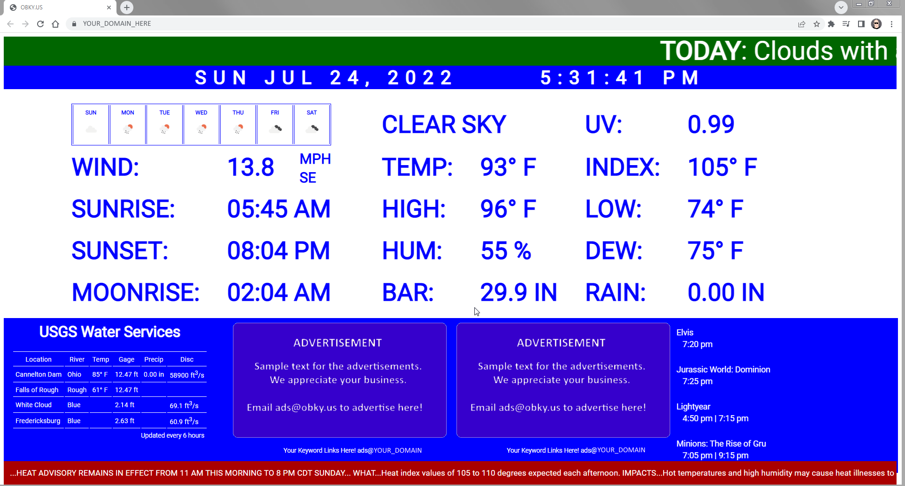

# time-temp-webpage

> I saw an old photo of a time & temperature cable channel from when I was a kid recently. This is a
> webpage to mimic that old cable channel... just for the fun and nostalgia of doing it. It will pull 
> data from a couple APIs and build a webpage for the time and temperature. Note: if you are from my
> and remember Channel 8, this is **not** an exact replica... don't come at me! :)



## APIs

### [OpenWeatherMap](https://openweathermap.org/)
You will need to have an APIKEY with OpenWeatherMap to use their API. I am using the free account which limits the number of hits per day. I only pull down a new weather.json file every 2 minutes to make sure I stay under the daily allowance.
- Be sure to change the `lat` and `lon` parameters for your location
- You can choose the type of units you get back from the API, since I'm based in the U.S. you'll see I chose to use `imperial` as the units.
- You will also need to get an API Key and replace that in the URI.

Example URI:
```
https://api.openweathermap.org/data/3.0/onecall?lat=37.76&lon=-87.13&units=imperial&appid=YOUR_OPENWEATHERMAP_APIKEY
```

### [USGS Water Services - USGS Daily Values](https://waterservices.usgs.gov/rest/DV-Service.html/)
This site does not require an API, but it was a little cumbersome to determine exactly how to use the API and get a JSON object as the response.
- Be sure the `format` in your URI is `json`
- You can pull data for multiple sites by separating each site id with a comma
- You can pull data for multiple parameters by separating each parameterCd with a comma

Example URI:
```
https://waterservices.usgs.gov/nwis/iv?format=json&sites=03303280,03318010,03303000,03302800&parameterCd=00010,00045,00060,00065
```

### [Movie Data](#!)
This site is scraping my local movie theater website to get the day's current movies. You
will have to replace this block with your own version, or some other type of data.

---

## The Webpage
The webpage only has three files:

1.  index.php - contains all the code for the webpage. The php will pull in the data from JSON files stored in the website's folder. Those JSON files get pull through separate cronjobs, which will be described below.

2.  site.css - this is the CSS (stylesheet) for the site.

3.	email.txt - this file contains the email address to display on the webapge. You will need to create this on your own.


---

## Setting Cronjobs up to pull the API data

```
*/2 * * * * json=`curl -s "https://api.openweathermap.org/data/3.0/onecall?lat=37.76&lon=-87.13&units=imperial&appid=YOUR_OPENWEATHERMAP_APIKEY"` && echo $json | jq . >/var/www/YOUR_DOMAIN/public_html/weather.json
0 */6 * * * water_json=`curl -s "https://waterservices.usgs.gov/nwis/iv?format=json&sites=03303280,03318010,03303000,03302800&parameterCd=00010,00045,00060,00065"` && echo $water_json | jq . >/var/www/YOUR_DOMAIN/public_html/water.json
5 0-5,18-23 * * * bash /var/www/YOUR_DOMAIN/public_html/pull_movies.sh
```

- The first job will pull the weather data from OpenWeatherMap every 2 minutes.
- The second job will pull hte water data from USGS Water Services every 6 hours.
- The third job will run a script that scrapes the local movie theater website. You either won't need this or will need to totally build something on your own. My script is very unique to the one website.
